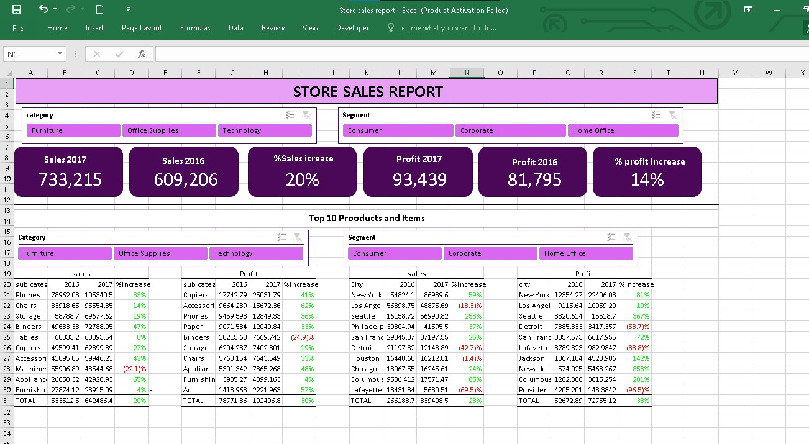
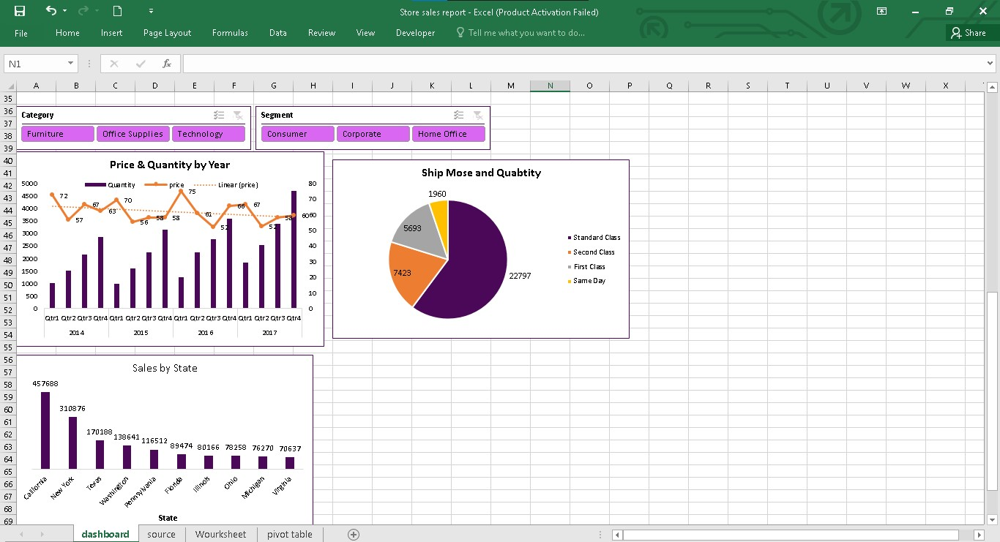

# Data Analysis Portfolio
Microssoft Excel

# Store Sales Analysis(2014-2017) 

# Objectives
1. Deternine Total Sales and Profit.
2. Identify best performing Sub_Cayegory Products and Cities.
3. Identify Trends in Revenue and Prices.
4. Determine shippimg modes preferences.
[Download Excel WorkBook](Excel File/Store sales report.xlsx)

# Findings 
1. Sales and Revenue Growth:
   - Over the past 2 years, sales have increased by 20%, and revenue has grown by 14%.
2. Profit Margins by Product Category:
   - Technology products had a healthy profit margin of 19%.
   - Office supplies followed with a 16% margin.
   - Furniture had the lowest margin at 1%.
  
3. Product Performance:
   - High Revenue Sub-Categories:
     - Phones, chairs, and storage products contributed significantly to revenue.
   - High Profit Sub-Categories:
     - Copiers, accessories, and phones generated the highest profits.
    
4. Sales Trends:
   - Quantity sold increased each quarter but dropped at the start of every new quarter.
   - Prices exhibited volatility and a negative overall trend.

   

